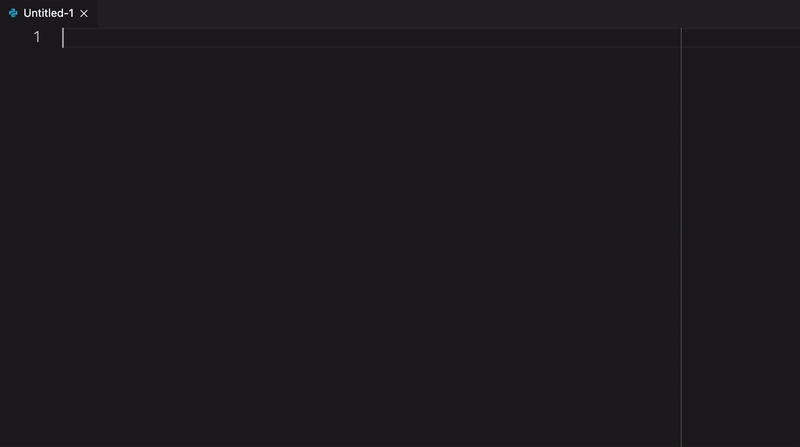

# MNE-Python Snippets

A collection of snippets for producing minimal working examples for MNE-Python.



## Usage

Simply type

```python
import mne
```

while in Python language mode and select the desired snippet from the
IntelliSense proposals.

## Known Issues

None so far.
